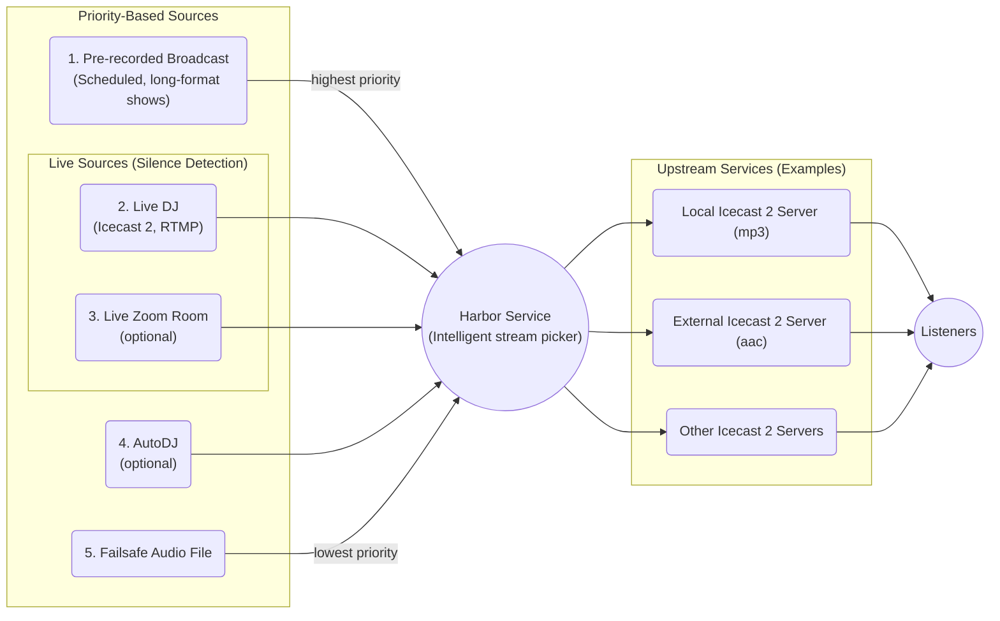

# Crazy Arms Radio Backend

!!! danger "Crazy Arms is under active development"
    Crazy Arms is currently under active development, however you can preview
    things right now. This documentation is incomplete, is missing sections, and
    may include incorrect information until the first release.

Crazy Arms Radio Backend is a flexible and fully featured Internet radio back-end
written from the ground up.

It's specifically written after its author built a few _fully decentralized_
online radio stations with varying types of scheduling and finding no existing
product fit some common needs out of the box.

If you're an technical user or a systems administrator wanting to install Crazy
Arms, head over to the [installation docs](./installation.md).

## Audio Infrastructure Overview

### Sources, Harbor, and Upstreams Explained

The main audio component of Crazy Arms is called the **Harbor.** This is a
customizable script, implemented in [Liquidsoap](https://www.liquidsoap.info/)
that takes care of choosing what to broadcast and when. Think of the Harbor as a
robot taking several sources and deciding which one is best to broadcast from
based on some simple rules.

The harbor has several input **sources**. These are things like pre-recorded
broadcasts, live DJs, or the AutoDJ. Each are each assigned a priority, and the
source with the highest priority _that is active_ will be what the harbor chooses
to play.

!!! note "Inactive Sources"
    When a source goes from inactive to active, the harbor will smootly fade to it.

    For the _"Live Sources"_ listed below (Zoom and Icecast), there's a feature
    called **silence detection.** This means _if a DJ is **connected but broadcasting
    silence,**_ that source will be **considered inactive** and the **first active
    source with less priority will be broadcast.**

    The theory behind this feature is part of the _Idiot-Tolerant(tm)_ DJing
    philosophy of Crazy Arms. :wink:

## Features At a Glance

Priority-based Streaming
:   Crazy Arms operates on the concept of priority. This means it chooses the
    source (audio input) that is streaming, properly operating, or online with
    the highest priority. For example, a live DJ takes priority over the AutoDJ.
    See [more info on this concept below](#sources-harbor-and-upstreams-explained).

Live scheduling via Google Calendar
:   Scheduling of live DJs using Google Calendar. An invite to a calendar event means
    a DJ is authorized to play. Simple as that.

    Rather than re-invent the wheel, Google Calendar was chosen because of its wide
    adoption and east of use &mdash; and implementation of recurring events.. Your
    web front-end can integrate with that, rather than a complex, custom API.

Scheduled playout of long-format audio files, ie prerecorded shows
:   A major use case is taking long-format audio files (ie two hours) and scheduling
    them to play at specific times, superseding the AutoDJ.

Broadcasting for non-technical users with [Zoom](https://zoom.us/)
:   This is implemented with Zoom for Linux using a Docker container. A "runner"
    bash script does its best to connect to a user's Zoom room and listen in.
    It's inherently a bit brittle, but can be troubleshooted somewhat easily in
    a web browser running [noVNC](https://novnc.com/info.html) by an admin.

_Idiot-Tolerant(tm)_ DJing
:   If a live DJ or Zoom room is broadcasting silence, Crazy Arms picks another
    source to stream from.

Completely [Docker](https://www.docker.com/)-ized
:   Easy development and easy deployment using
    [docker-compose](https://docs.docker.com/compose/).

Useful and informative station administration and status tools.
:   Leveraging [Django](https://docs.djangoproject.com/en/3.1/)'s admin
    interface much of Crazy Arms can be managed by administrators (or users with
    the necessary permissions).

    A status page is also provided that uses
    [server-sent events](https://en.wikipedia.org/wiki/Server-sent_events) in
    which the Harbor service script communicates directly with your web browser
    in real-time.

Uploading audio from varied sources
:   Uploading of audio files from sources like [SoundCloud](https://soundcloud.com/),
    [Mixcloud](https://www.mixcloud.com/), or [YouTube](https://www.youtube.com/) are
    supported. Just enter a URL and the Crazy Arms downloads and processes your audio file.

    This utilizes the wonderful [youtube-dlc](https://github.com/blackjack4494/yt-dlc)
    tool and supports literally
    [_thousands of sites_](https://github.com/blackjack4494/yt-dlc/blob/master/docs/supportedsites.md)!

An AutoDJ that plays blocks of advertisements and station IDs (stop sets)
:   This feature can optionally be enabled in the _"Server Settings > Configuration"_
    section.

Fine-grained user permission structure.
:   If a user is _not_ an administrator, there are several permission groups to
    allow them some administrative privileges.

Accessible Logs
:   Less technical users can see server logs without `ssh` or command-line knowledge
    to help troubleshoot. Maybe a DJ got their password wrong or tried to broadcast
    at the wrong time?

Streaming Customization
:   At your own risk, you can modify [Liquidsoap](https://www.liquidsoap.info/)
    Harbor scripts. This gives pretty high flexibility for various use cases.

RTMP Support (Experimental)
:   There's experimental support for RTMP, so anyone who's familiar with tools
    like [Open Source Broadcaster (OBS)](https://obsproject.com/) can stream to
    the harbor. Of course, video is discarded.

### Non-Features

_The following are non-features of Crazy Arms._

Front-end Not Included
:   Crazy Arms is designed to be a backend for your radio stream only. A user
    interface that includes calendars, a fancy stream player, and metadata
    isn't included.

Admin Site Look and Feel
:   The admin site for Crazy Arms has a fairly inflexible look and feel. It's
    not necessarily a beautiful, easy to use interface but instead meant for
    somewhat technical users. This is by design and was chosen for ease of
    programming. The technical reason for why is that we chose to build it on
    top of [Django's admin site](https://docs.djangoproject.com/en/3.1/ref/contrib/admin/)
    module.
